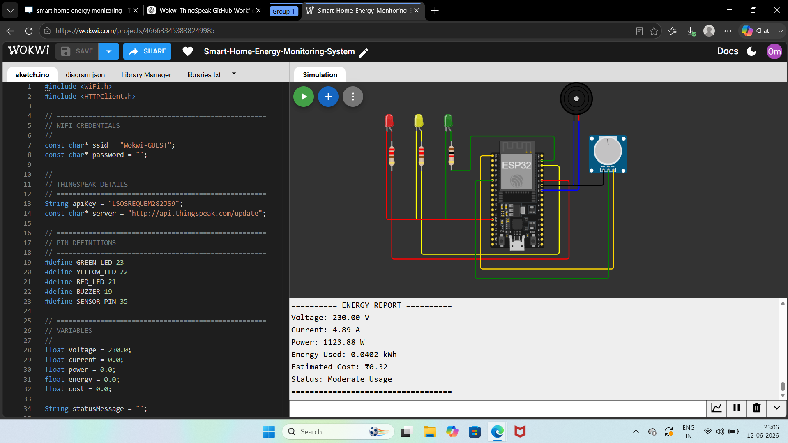
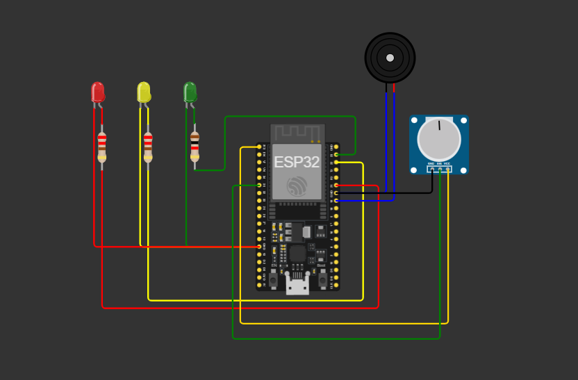
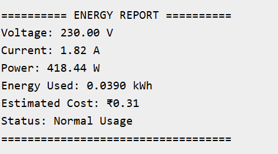
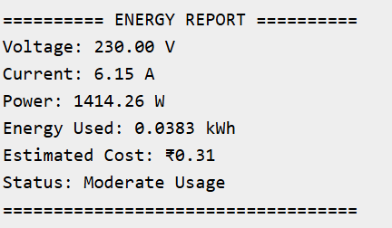
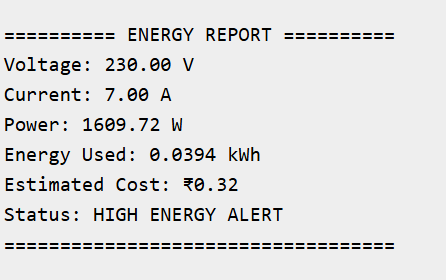
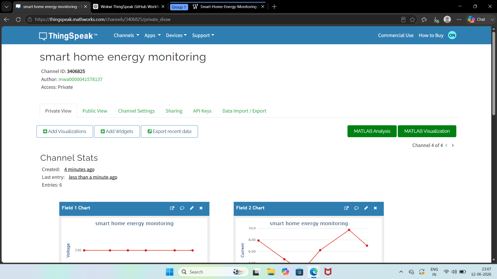
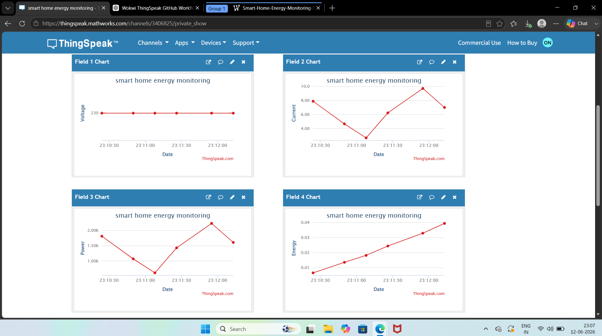
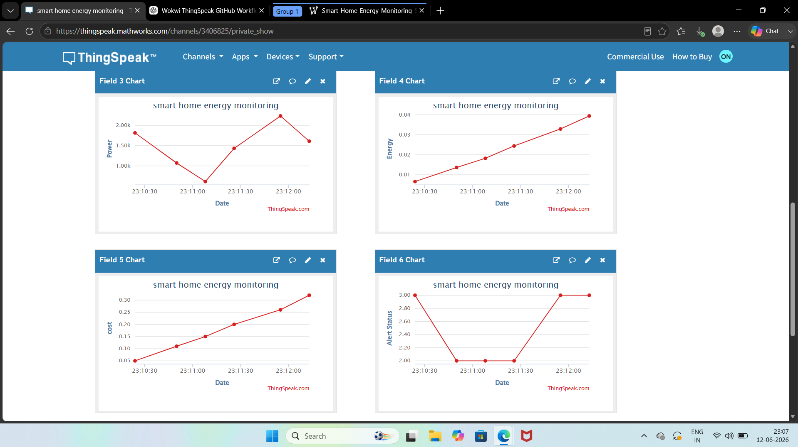

# Smart Home Energy Monitoring System using ESP32, Wokwi & ThingSpeak

An IoT-based Smart Home Energy Monitoring System developed using ESP32, Wokwi, and ThingSpeak to monitor real-time electricity consumption. The system calculates voltage, current, power, energy usage, and estimated electricity cost while providing smart alerts through LEDs and a buzzer for different energy consumption levels. Real-time data is visualized on a ThingSpeak cloud dashboard with live graphs for efficient energy management and smart home automation.

---

# 📌 Project Overview

The **Smart Home Energy Monitoring System** is an IoT-based solution designed to monitor household electricity consumption in real time. This project uses an **ESP32 microcontroller**, **Wokwi simulation**, and **ThingSpeak cloud platform** to monitor important electrical parameters such as:

* Voltage
* Current
* Power Consumption
* Energy Usage (kWh)
* Estimated Electricity Cost
* Energy Alert Status

The system intelligently detects energy consumption levels and provides alerts using **LED indicators** and a **buzzer** for efficient energy management.

---

# 🚀 Features

✅ Real-Time Energy Monitoring
✅ Voltage, Current & Power Calculation
✅ Energy Consumption Tracking (kWh)
✅ Estimated Electricity Cost Calculation
✅ Smart Alert System (Normal / Moderate / High Usage)
✅ LED Status Indicators
✅ Buzzer Alert for High Consumption
✅ ThingSpeak Cloud Dashboard Integration
✅ Live Data Visualization & Graphs
✅ ESP32-Based IoT Implementation
✅ Wokwi Simulation Support

---

# 🛠️ Technologies Used

| Technology            | Purpose                 |
| --------------------- | ----------------------- |
| ESP32                 | Microcontroller         |
| Wokwi                 | Circuit Simulation      |
| ThingSpeak            | Cloud Dashboard         |
| Arduino IDE / VS Code | Development Environment |
| GitHub                | Version Control         |

---

# ⚙️ Hardware Components

* ESP32 Development Board
* LEDs (Green, Yellow, Red)
* Potentiometer
* Buzzer
* 220Ω Resistors
* Jumper Wires

---

# 🏗️ Project Workflow

```text
Wokwi Simulation
       ↓
ESP32 Data Processing
       ↓
Energy Calculation
       ↓
Alert Generation
       ↓
ThingSpeak Cloud
       ↓
Real-Time Dashboard Visualization
```

---

# 🔌 Circuit Connections

## LED Connections

| Component  | ESP32 Pin |
| ---------- | --------- |
| Green LED  | GPIO23    |
| Yellow LED | GPIO22    |
| Red LED    | GPIO21    |

## Buzzer Connection

| Component | ESP32 Pin |
| --------- | --------- |
| Buzzer    | GPIO19    |

## Potentiometer Connection

| Potentiometer Pin | ESP32 Pin |
| ----------------- | --------- |
| VCC               | 3.3V      |
| GND               | GND       |
| SIG               | GPIO35    |

---

# ⚡ Working Principle

The potentiometer acts as a simulated current sensor in the Wokwi environment. The ESP32 continuously reads analog values and converts them into current measurements.

Power is calculated using:

P = V × I

The system calculates:

* Current (A)
* Power (W)
* Energy Consumption (kWh)
* Estimated Electricity Cost (₹)

### Alert Logic

🟢 **0W – 500W** → Normal Usage
🟡 **500W – 1500W** → Moderate Usage
🔴 **Above 1500W** → High Energy Alert + Buzzer

The ESP32 uploads sensor data to **ThingSpeak every 15 seconds** for live cloud monitoring.

---

# 📊 ThingSpeak Fields

| Field   | Parameter    |
| ------- | ------------ |
| Field 1 | Voltage      |
| Field 2 | Current      |
| Field 3 | Power        |
| Field 4 | Energy       |
| Field 5 | Cost         |
| Field 6 | Alert Status |

```md
# 📸 Project Screenshots

## 1. Wokwi Simulation


## 2. Wokwi Circuit Connection


## 3. Serial Monitor - Normal Usage


## 4. Serial Monitor - Moderate Usage


## 5. Serial Monitor - High Energy Alert


## 6. ThingSpeak Dashboard


## 7. ThingSpeak Graphs (Voltage & Current)


## 8. ThingSpeak Graphs (Power, Energy & Cost)

```


# 📈 Results

The system successfully:

* Monitored electricity consumption in real time
* Calculated voltage, current, and power
* Tracked energy consumption
* Estimated electricity cost
* Generated smart energy alerts
* Uploaded live data to ThingSpeak
* Displayed real-time cloud graphs

---

# 🎯 Applications

* Smart Homes
* Energy Monitoring Systems
* Smart Buildings
* Industrial Energy Tracking
* Electricity Bill Monitoring

---

# 🔮 Future Scope

* Mobile App Integration
* Real Sensor Implementation
* AI-Based Energy Prediction
* Smart Appliance Automation
* Automatic Energy Saving Recommendations

---

# 👨‍💻 Mentor

**Umesh Yadav**
EDC IIT-Delhi

---

# 👨‍🎓 Developed By

**Om Navgire**
Electronics & Telecommunication Engineering (EXTC)
Prof. Ram Meghe Institute of Technology And Research, Amravati

---

# 🤝 Contributing

Contributions are welcome! Feel free to fork this repository and improve the project.

---

# 📜 License

This project is developed for educational and learning purposes.

---

# ⭐ Show Your Support

If you found this project useful, please consider giving it a ⭐ on GitHub!
